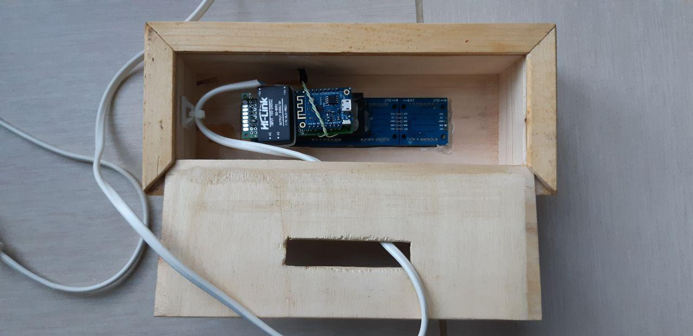
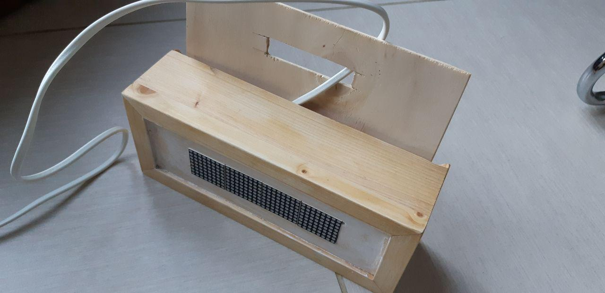
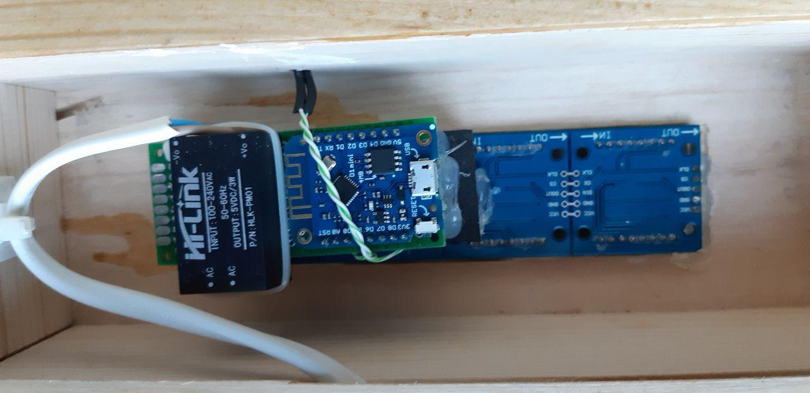
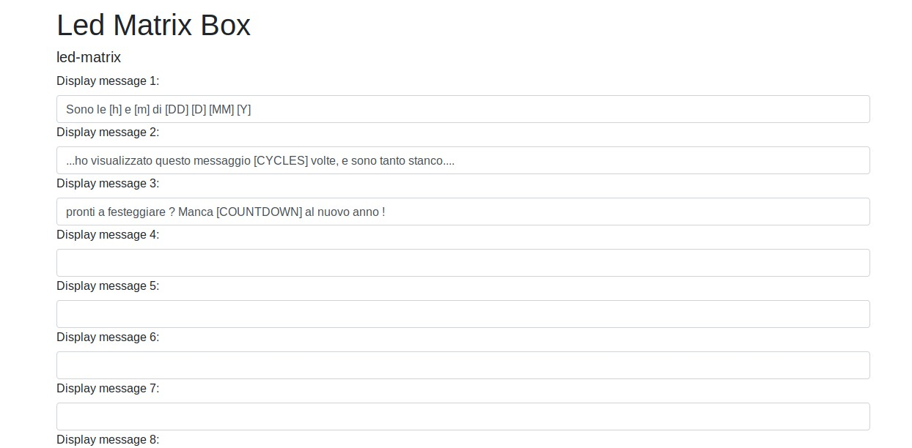
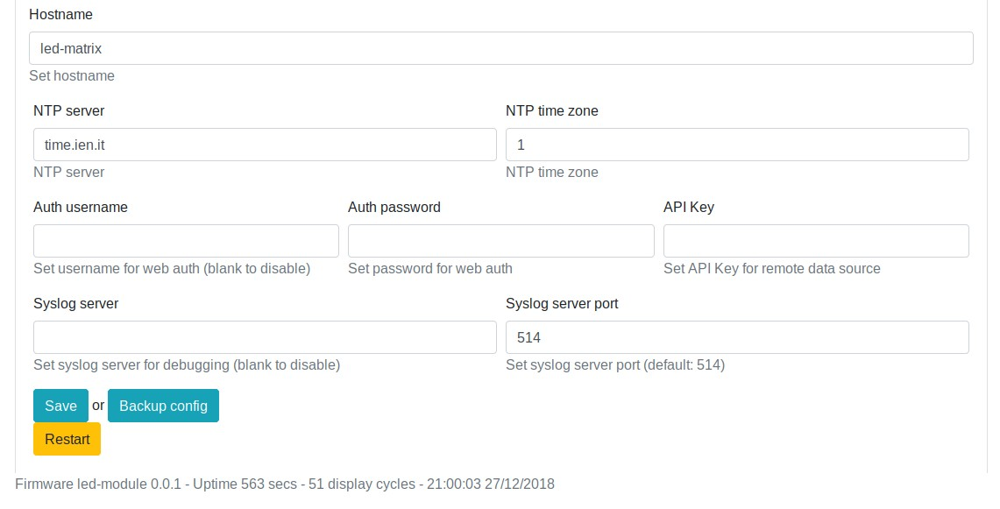

Led Matrix Controller
=====================

Introduction
------------

A simple gadget that really like everyone: 4 led matrix displays that show the date, time or a message 
to your liking. You can put it in the living room, in the shop window, on the work desk ... and it will 
charm all those who come to see you!

Dependencies:
-------------

* Syslog Logger library from https://github.com/arcao/Syslog/
* Arduino Json library from https://arduinojson.org/
* NTP Client library from https://github.com/gmag11/NtpClient

Hardware BOM:
-------------

* [1 ESP8266 module like WeMos D1 mini](https://it.aliexpress.com/item/Wemos-D1-Mini-V3-0-0-WIFI-Internet-delle-Cose-Scheda-di-Sviluppo-Basata-ESP8266-CH340/32845084675.html)
* [4 led matrix array based on MAX7219](https://it.aliexpress.com/item/MAX7219-Dot-Matrix-Modulo-Microcontrollore-4-In-Un-Display-con-5-P-Linea/32841678065.html)

Wiring diagram
--------------

WIP ;)

A nice case
-----------------

Web Interface
-------------

Displayed data should be entered via the included simple web interface, build with Bootstrap. Just go via browser to the IP assegned and type in the fields configuration 
values and strings to display.

Variables
---------

[Y] = year

[M] = month

[D] = day

[h] = hour

[m] = minute

[s] = seconds

[DD] = day of week (Sunday, Monday...)

[MM] = month name (January, February...)

[IDX] = index of string displayed

[UPTIME] = millis() of uptime

[CYCLES] = how many display cycles

[COUNTDOWN:{timestamp}] = countdown to {timestamp} - please note there's no error check so be nice ;-)

ChangeLog 
---------
*v0.0.3* (30.12.2018)
- Some fixes

*v0.0.2* (27.12.2018)
- Lot of improvements, bug fixed, more stable

*v0.0.1*
- First release

